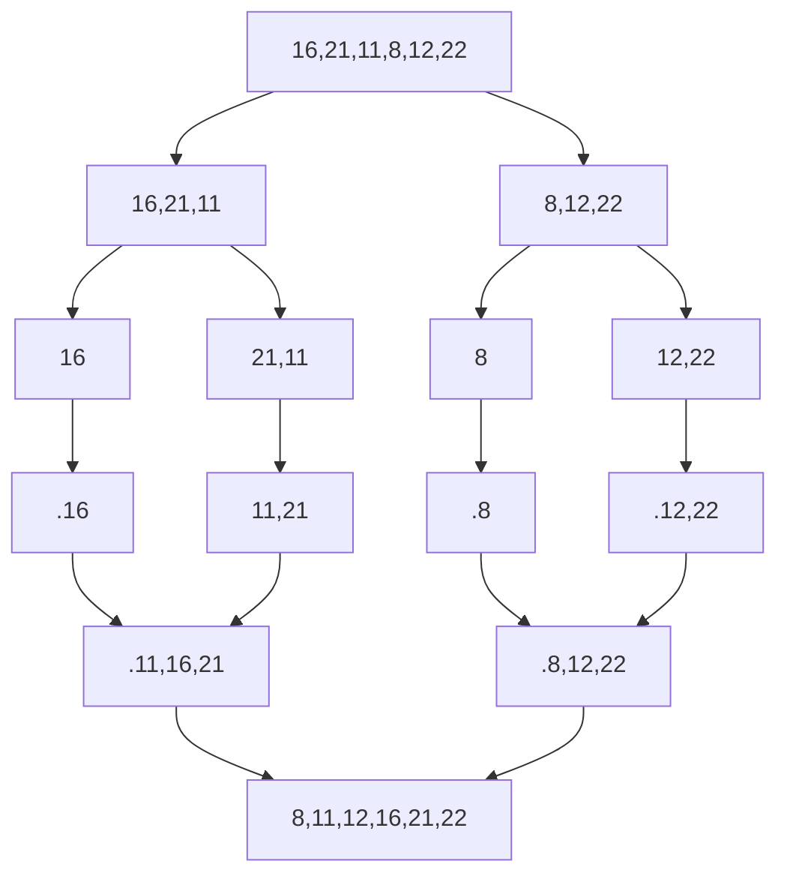

# MERGE SORT

Abdullah Demirkol'a patika.dev sitesinde [ademirkol](https://app.patika.dev/ademirkol) kullanıcı adı ile ulaşabilirsiniz.

## Patika.dev'de veri yapıları kursu için yapılan proje

## **SORU 1 -** [16,21,11,8,12,22] -> Merge Sort

> **Merge Sort Hatırlatma** 
> >Bir listeyi her adımda parçaya ayırıp tek eleman kalıncaya kadar bölüyor. Böldükten sonra sıralı bir şekilde bize sunuyor.

### A - Yukarı verilen dizinin sort türüne göre aşamalarını yazınız.

**Toplam islem sayısı 6**

### B - Big-O gösterimini yazınız.

 O(nlogn) -> O(6log6)