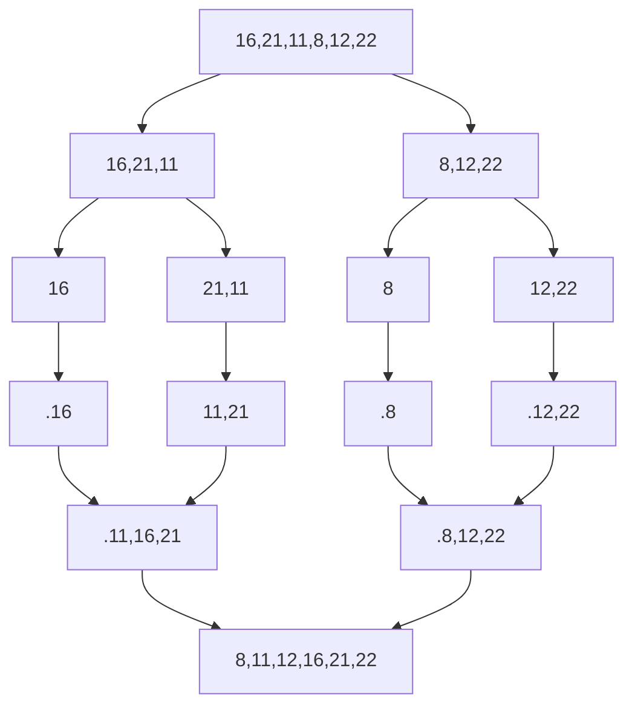

# MERGE SORT

Abdullah Demirkol'a patika.dev sitesinde [ademirkol](https://app.patika.dev/ademirkol) kullanıcı adı ile ulaşabilirsiniz.

## Patika.dev'de veri yapıları kursu için yapılan proje

## **SORU 1 -** [16,21,11,8,12,22] -> Merge Sort

> **Merge Sort Hatırlatma** 
> >Bir listeyi her adımda parçaya ayırıp tek eleman kalıncaya kadar bölüyor. Böldükten sonra sıralı bir şekilde bize sunuyor.

### A - Yukarı verilen dizinin sort türüne göre aşamalarını yazınız.

**Toplam islem sayısı 6**

### B - Big-O gösterimini yazınız.

O(n^2

### C - Time Complexity:

**Average case:** Aradığımız sayının ortada olması.

**Worst case:** Aradığımız sayının sonda olması.

**Best case:** Aradığımız sayının dizinin en başında olması.

### D - Dizi sıralandıktan sonra 18 sayısı hangi case kapsamına girer?

[2,6,16,18,22,27]=> Siralanmis dizi

Aradigimiz sayi basta(best case ve sonda(worse case olmadigindan beklenilen durum olarak Average Case'dir

## **SORU 2-** [7,3,5,8,2,9,4,15,6] dizisinin Insertion Sort'a göre ilk 4 adımını yazınız.

1-[2,3,5,8,7,9,4,15,6] -> 2 ile 7 sayısı yer değiştirdi

2-[2,3,4,8,7,9,5,15,6] -> 5 ile 4 sayısı yer değiştirdi

3-[2,3,4,5,7,9,8,15,6] -> 8 ile 5 sayısı yer değiştirdi

4-[2,3,4,5,6,9,8,15,7] -> 6 ile 7 sayısı yer değiştirdi